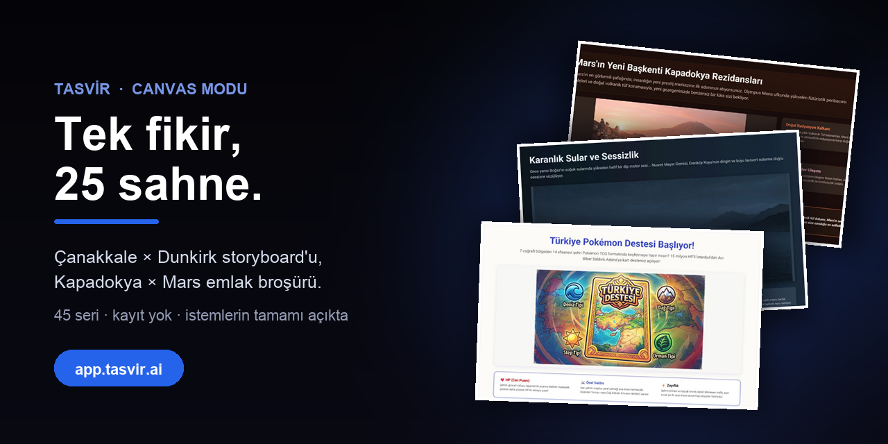

<div align="center">



# Canvas Modu — Tek Fikir, 25 Sahne

### Bir konuyu, kimsenin beklemediği bir formatta anlat. Gerisini yapay zekâ planlasın, yazsın ve çizsin.

[](https://app.tasvir.ai?src=github&utm_source=github&utm_medium=readme&utm_campaign=canvas-tr&utm_content=top)
[](https://www.youtube.com/watch?v=o5D5XRN3bdo)
[](https://tasvir.ai/tr/ozellikler/)

[🏠 Tasvir uygulaması](https://github.com/Tasvir-app/Tasvir-TR) · **🎨 Canvas Modu** · [📚 YKS Hazırlık](https://github.com/Tasvir-app/Tasvir-YKS-Hazirlik) · [🇬🇧 English](https://github.com/Tasvir-app/Tasvir-Canvas-Mode)

</div>

Çanakkale'yi bir Christopher Nolan filminin storyboard'u gibi, Kapadokya'yı Mars'ta satılan bir emlak broşürü gibi, Türkiye'nin illerini Pokémon kartları gibi anlatan 45 seri. Her biri **tek bir istemden** çıktı: planı yapay zekâ kurdu, 25 sahneyi o yazdı, her sahnenin görselini o çizdi.

## Canvas modu ne?

Tasvir iki çeşit sayfa üretiyor. **Doküman** A4, A3 ya da slayt gibi sabit, yazdırılabilir sayfalardan oluşuyor; metin ölçülüp sayfalanıyor. **Canvas** ise 1440 piksel genişliğinde, içeriğe göre uzayan serbest bir sahne. Kağıt kalıbı olmadığı için her sayfa bir afiş, bir film karesi, bir dergi kapağı ya da bir koleksiyon kartı olabiliyor.

Buradaki seriler canvas modunda üretildi: **25 sahne, her sahne kendi başına tamamlanan bir sayfa**, hepsi aynı görsel dille.

## Öne çıkan altı seri

Görsele tıkla: seri tarayıcıda açılır, kayıt istemez.

<table>
  <tr>
    <td align="center" width="33%"><a href="https://app.tasvir.ai/c/b2e74bf219e1b6a12e2283777110287ea56d70b07883b4b652a20cec3acdceae/1"></a><br/><strong>Çanakkale 18 Mart</strong><br/><sub>× Dunkirk storyboard</sub></td>
    <td align="center" width="33%"><a href="https://app.tasvir.ai/c/b5c48ea62091a85c950d91b4de1ad69986019eb02a585f94dfe82f184550fc8d/1"></a><br/><strong>Türkiye illeri</strong><br/><sub>× Pokémon kartları</sub></td>
    <td align="center" width="33%"><a href="https://app.tasvir.ai/c/fcfb0fdabb02397ac3ad52d0640173f6362e83bf082307d1c2fb96dd64f2e2ad/1"></a><br/><strong>Kapadokya</strong><br/><sub>× Mars kolonisi emlak broşürü</sub></td>
  </tr>
  <tr>
    <td align="center" width="33%"><a href="https://app.tasvir.ai/c/76acf83754f990ab0cf6012aef077108069fac7b5746d87831bb79fbb04f0dc2/1"></a><br/><strong>Türk düğünü</strong><br/><sub>× NASA fırlatma sekansı</sub></td>
    <td align="center" width="33%"><a href="https://app.tasvir.ai/c/1f94917cec52486812bb5e44fbdb085f94b2c8a984ddb0c63c7ffbc250aeb88b/1"></a><br/><strong>Kemal Sunal karakterleri</strong><br/><sub>× kariyer koçluğu</sub></td>
    <td align="center" width="33%"><a href="https://app.tasvir.ai/c/becb80c7e7d2fa0e41ceabb787af500f7e7395767d3a4390c6701a9e5bc84e0b/1"></a><br/><strong>Transformer attention</strong><br/><sub>× Divan-ı Hümayun</sub></td>
  </tr>
</table>

## Formül: konu × beklenmedik format

Hepsinin arkasında aynı fikir var. Bildiğin bir konuyu al, onu hiç ait olmadığı bir formatın içine koy:

```
[konu] × [format]
Malazgirt 1071   × NASA görev kontrol transkripti
CRISPR           × IKEA montaj kılavuzu
Çay demleme      × ISO 9001 kalite dokümanı
```

Format, anlatımın iskeletini veriyor: bir LinkedIn profilinin başlıkları, bir Pokémon kartının HP'si, bir emlak broşürünün metrekare tablosu. Konu ise gerçek kalıyor; tarih, sayı ve isimler doğru.

**[Kendi serini dene →](https://app.tasvir.ai?src=github&utm_source=github&utm_medium=readme&utm_campaign=canvas-tr&utm_content=formula)** — kayıt olan her hesaba hediye kredi tanımlanıyor, ilk serine yeter; kart istenmiyor.

---

## Serilerin tamamı

İstemlerin hepsinin sonuna aynı cümle eklendi; seriyi canvas modunda ve 25 sahne olarak kuran kısım bu:

> Çıktı biçimi: en az 25 sayfalık, çok sahneli görsel canvas serisi; her sayfa kendi başına tamamlanan bir sahne. A4 doküman, dergi ya da slayt sunumu olarak değil. Listelenen öğeler 25 sahneden azsa her birini birden fazla sahneye yay.

### Tarih

| Konu | Format | |
|---|---|---|
| Çanakkale 18 Mart | Dunkirk storyboard | [Aç](https://app.tasvir.ai/c/b2e74bf219e1b6a12e2283777110287ea56d70b07883b4b652a20cec3acdceae/1) |
| Malazgirt 1071 | NASA görev kontrol | [Aç](https://app.tasvir.ai/c/50a2237ec67b3a6dcd9b4c6785f2cd184ca081a989034a360dbed1e811c28c94/1) |
| Kurtuluş Savaşı | startup pitch deck | [Aç](https://app.tasvir.ai/c/a1435941fe691e796732bdd6c43943da2a36112bca594642947b51783d245439/1) |
| Kayıp Osmanlı meslekleri | LinkedIn profili | [Aç](https://app.tasvir.ai/c/eadfde9585ee54f884b6ec7f014d587aa6a4148fd05c5d7821876815cbbe3688/1) |
| Sarıkamış 1914 | hava durumu bülteni | [Aç](https://app.tasvir.ai/c/ff2ee255886f7b57237dc93827d0bf7769b3c42d96d460b6f2cdd262ff6d63f2/1) |
| Ahmet Ertegün | Rolling Stone dosyası | [Aç](https://app.tasvir.ai/c/dcc3df233d3dc74c5a95935ed2fcabd9a615707ad954060193b5a4b1461b25c7/1) |

<details>
<summary>Bu bölümün 6 istemi</summary>

```
Çanakkale 18 Mart 1915'i Christopher Nolan'ın Dunkirk filmi gibi üç iç içe zaman
çizgisinde anlat: kara (Seyit Onbaşı ve 215 kiloluk mermi), deniz (Nusret mayın
gemisinin gece döşediği 26 mayın), boğaz suyunun altı (batan Bouvet, Irresistible,
Ocean). Her sahne bir film karesi gibi olsun, dakika dakika gerilim, gri-lacivert
sinematik palet, tepe noktası üç çizginin aynı anda buluştuğu an. Gerçek tarih,
abartısız ama tüyleri diken diken eden bir anlatım.

Malazgirt Savaşı 1071'i NASA görev kontrol transkripti gibi anlat: T-eksi saatlerle
geri sayım, iki ordunun telemetri tabloları (asker sayısı, mesafe, ikmal), Sultan
Alparslan ve Romen Diyojen için ayrı uçuş direktörü notları, sahte ricat manevrası
bir görev anomalisi raporu gibi. Karanlık konsol teması, yeşil-amber ekran
vurguları, gerçek tarih bilgisi korunsun.

Kurtuluş Savaşı'nı bir startup hikayesi gibi pitch deck estetiğinde anlat: 19 Mayıs
Samsun garajda kuruluş, Amasya Genelgesi vizyon belgesi, Erzurum ve Sivas kongreleri
seed round, Sakarya product-market fit, Büyük Taarruz exit. Her sahnede gerçek
tarih, sayı ve isim olsun. Mizahlı ama saygılı, kurucu ruhunu onurlandıran bir ton.

Kaybolmuş 12 Osmanlı mesleğini (bozacı, saka, meddah, mahya ustası, kavukçu, hattat,
sebilci, ciğerci, tulumbacı, arzuhalci, macuncu, hamam tellağı) her biri bir
LinkedIn profili gibi anlat: unvan, deneyim, yetenekler, önerilen bağlantılar, bir
müşteriden referans yazısı. Her profilin portresi Osmanlı minyatürü stilinde olsun.
Her meslek bir sayfa, hepsi aynı profil şablonuyla. Nostaljik, sıcak ve biraz
esprili.

Sarıkamış Harekâtı'nı (Aralık 1914 - Ocak 1915) günlük hava durumu bülteni gibi
anlat: her sayfa bir günün bülteni, sıcaklık, rüzgar, kar kalınlığı, Allahuekber
Dağları rakımı; her bültenin altında o günün gerçek insan hikayesi. Soğuk beyaz-mavi
palet, sade ve ağırbaşlı ton, sonda sessiz bir anma sayfası.

Ahmet Ertegün'ün Atlantic Records'u kurup Ray Charles, Aretha Franklin ve Led
Zeppelin'i dünyaya tanıtmasını Rolling Stone kapak dosyası gibi anlat: kapak, uzun
röportaj, plak zaman çizelgesi, Washington'daki Türk büyükelçiliğinden caz
kulüplerine uzanan hikaye. 60'lar dergi tipografisi, sıcak vintage palet.
```

</details>

### Coğrafya

| Konu | Format | |
|---|---|---|
| Türkiye illeri | Pokémon kartları | [Aç](https://app.tasvir.ai/c/b5c48ea62091a85c950d91b4de1ad69986019eb02a585f94dfe82f184550fc8d/1) |
| İstanbul Boğazı'nın oluşumu | cinayet dosyası | [Aç](https://app.tasvir.ai/c/4a7f4132fa856ce7bf0114b568744c7a82947d25880db0317890a83805a2d964/1) |
| Dünyanın en saçma sınırları | travel noir | [Aç](https://app.tasvir.ai/c/0c1d3c26a53f7e3c80f0529fa982d3ae40a18b40323a3f5fe647b672708e6f98/1) |
| Kapadokya | Mars kolonisi emlak broşürü | [Aç](https://app.tasvir.ai/c/fcfb0fdabb02397ac3ad52d0640173f6362e83bf082307d1c2fb96dd64f2e2ad/1) |
| Van Gölü | denizaltı seyir defteri | [Aç](https://app.tasvir.ai/c/296603a1271d7aa20ab712df1fa5a1dc90908c795c4d7f76b3748e81b064f2f1/1) |
| Anadolu antik kentleri | Airbnb ilanları | [Aç](https://app.tasvir.ai/c/04009e5365da712bd14a33235ab479a9c97b55ea99fe92a9b9065e163c87babe/1) |

<details>
<summary>Bu bölümün 6 istemi</summary>

```
Türkiye'nin 7 bölgesinden 14 ili (her bölgeden 2 il) Pokémon kartı gibi anlat: tip
(deniz, dağ, step, orman), HP olarak nüfus, özel saldırı olarak yerel yemek, savunma
olarak coğrafi özellik, zayıflık olarak şehrin bilinen derdi, evrim olarak tarihi
adı. Her il bir kart sayfası, hepsi aynı kart şablonuyla, her kartın illüstrasyonu
şehrin simgesiyle. Esprili ama gerçek bilgilerle.

İstanbul Boğazı'nın oluşumunu bir cinayet soruşturması dosyası gibi anlat: şüpheli
Karadeniz, olay yaklaşık 7.500 yıl önceki büyük taşma hipotezi, tanık Marmara
Denizi, deliller tortu katmanları ve batık kıyı çizgileri, rakip teori avukatlarının
itirazları. Polis dosyası formatı, delil fotoğrafları, sonuçta bilim insanlarının
hâlâ tartıştığı açıkça söylensin.

Dünyanın en tuhaf sınırlarını (Baarle-Hertog ve Baarle-Nassau, sahipsiz Bir Tawil,
Büyük ve Küçük Diomede arasındaki tarih çizgisi, Sülün Adası'nın (Pheasant Island) 6
ayda bir İspanya ile Fransa arasında el değiştirmesi, Point Roberts) bir travel noir
dergisi gibi anlat. Her sınır bir hikaye, siyah-beyaz fotoğraf estetiği, kuru ve
zeki bir mizah.

Kapadokya'yı Mars kolonisine satılan lüks bir emlak broşürü gibi anlat: peribacası
daireleri, Derinkuyu Residence yeraltı şehri kat planları ve metrekare tabloları,
Göreme açık hava müzesi sosyal tesis, balon turu ulaşım, volkanik tüfün ısı yalıtımı
teknik şartname. Gerçek jeoloji ve tarih bilgisiyle, turuncu-pembe gün doğumu
paleti, fütüristik render görseller.

Van Gölü'nü bir denizaltı kaptanının seyir defteri gibi anlat: sodalı suyun kimyası,
dünyanın en büyük mikrobiyalit kuleleri, inci kefalinin nehirlere göçü, Akdamar
Adası, göl tabanındaki batık yerleşimler. Her kayıt tarih ve derinlik içersin, su
altı çizimleri, turkuaz-lacivert palet, keşif heyecanı.

Anadolu'nun 10 antik kentini (Efes, Afrodisias, Hierapolis, Bergama, Troya,
Göbeklitepe, Hattuşa, Sagalassos, Aspendos, Zeugma) her biri bir Airbnb ilanı gibi
anlat: başlık, özellikler, ev kuralları, konumu, misafir yorumları (tarihi
kişilerden), ev sahibinin notu. Her kent bir sayfa, aynı ilan şablonu, gerçek tarih
bilgisi, esprili ton.
```

</details>

### Bilim

| Konu | Format | |
|---|---|---|
| Aşkın nörokimyası | hormon aşk mektupları | [Aç](https://app.tasvir.ai/c/f2bf80c8973b683f65462dee564ea6177f3de168c7658dd430cd33f226761c89/1) |
| Ay-Dünya gelgit kilidi | evlilik danışmanlığı | [Aç](https://app.tasvir.ai/c/dee79964af7ebf08406a4333a319c3af89a7d64014deb612035e99befa0cd7c8/1) |
| Periyodik tablo | futbol transfer sezonu | [Aç](https://app.tasvir.ai/c/10a0555b6bb6d7408bfc420ab7d351c9b046676cea1d832c9686ba240d24011b/1) |
| Türev | soygun filmi | [Aç](https://app.tasvir.ai/c/380a562432770f895d4796d0f960a6bffd195b55b2a2e93014720bd8bb37c3dc/1) |
| İnsan gözü | kamera kullanım kılavuzu | [Aç](https://app.tasvir.ai/c/600211e4a992dca2c26109e8faefb5a7f9cd03c77c1838cb9fa4c31518e6f91d/1) |

<details>
<summary>Bu bölümün 5 istemi</summary>

```
Aşkın nörokimyasını hormonların birbirine yazdığı aşk mektupları gibi anlat:
dopamin, norepinefrin, serotonin, oksitosin, vazopressin, kortizol; her mektubun
yanında beyinde nerede çalıştığını gösteren bir beyin haritası ve gerçek bilimsel
bilgi kutusu. Romantik, nazik ve bilimsel olarak doğru, genç yetişkin okur.

Ay ile Dünya'nın 4,5 milyar yıllık ilişkisini evlilik danışmanlığı dosyası gibi
anlat: tanışma (Theia çarpışması), gelgit kilidi yüzünden Ay'ın hep aynı yüzünü
göstermesi, Ay'ın her yıl 3,8 cm uzaklaşması, günlerin uzaması. Danışman notları,
seans kayıtları, gökyüzü görselleri, hafif hüzünlü ve esprili.

Periyodik tabloyu futbol transfer sezonu gibi anlat: soy gazlar kulüp değiştirmeyen
sadık oyuncular, alkali metaller her takıma giden serbest oyuncular, halojenler
agresif golcüler, bonservis bedeli iyonlaşma enerjisi, elektronegatiflik transfer
pazarlığı gücü. Transfer kartları, gerçek kimya bilgisi, lise öğrencisi okur,
esprili.

Türevi bir soygun filmi gibi anlat: ekip üyeleri limit, zincir kuralı, çarpım kuralı
ve bölüm kuralı; hedef anlık hız kasası; her plan sahnesinde gerçek çözümlü örnek ve
plan tahtası çizimi; son sahnede büyük vurgun maksimum-minimum problemi. Lise son
öğrencisi okur, heyecanlı ve akılda kalıcı.

İnsan gözünü profesyonel bir kameranın kullanım kılavuzu gibi anlat: sensör retina,
ISO çubuk ve koni hücreleri, diyafram iris, otofokus lens kasları, kör nokta bilinen
hata, gözlük yazılım güncellemesi. Teknik çizimler, sade kılavuz tasarımı, bilimsel
olarak doğru.
```

</details>

### Sinema

| Konu | Format | |
|---|---|---|
| Godfather | MBA vaka çalışması | [Aç](https://app.tasvir.ai/c/b41b7fa227483099d1c295586c025b51869519f517f4ced428669f7b0a72559b/1) |
| Yeşilçam klişeleri | bilimsel makale | [Aç](https://app.tasvir.ai/c/81d24501f7d20f4d04c9a6ee6f1397ef23572fc1cdbaa6931bdb21cb3848081c/1) |
| Kemal Sunal karakterleri | kariyer koçluğu | [Aç](https://app.tasvir.ai/c/1f94917cec52486812bb5e44fbdb085f94b2c8a984ddb0c63c7ffbc250aeb88b/1) |
| Türk dizileri | dedektiflik kılavuzu | [Aç](https://app.tasvir.ai/c/410e685d994dc59934cf2a2d628e54a4da71006aa1d3b12d939eab57c68edccd/1) |

<details>
<summary>Bu bölümün 4 istemi</summary>

```
The Godfather'ı bir MBA vaka çalışması gibi anlat: Corleone aile şirketinin devir
planı, Vito'dan Michael'a liderlik geçişi, risk yönetimi, reddedilemeyecek teklif
müzakere modeli, organizasyon şeması, tartışma soruları. İş dünyası vaka formatı,
sepya tonlar.

Yeşilçam filmlerinin 10 klişesini ciddi bir bilimsel makale formatında anlat: özet,
hipotez, yöntem, bulgular (zengin kız fakir oğlan evlilik oranı, kör olan kahramanın
iyileşme süresi, kötü adamın bıyık katsayısı), grafikler, tartışma ve kaynakça.
Tamamen ciddi akademik dil ile anlatılan mizah, nostaljik ve sevgi dolu.

Kemal Sunal'ın unutulmaz karakterlerini (Şaban, İnek Şaban, Tosun Paşa'daki Şaban,
Kibar Feyzo, Postacı, Davaro'daki Memo) bir kariyer koçluğu dosyası gibi anlat:
güçlü yönler, gelişim alanları, 360 derece geri bildirim, önerilen kariyer yolu. Her
karakter bir sayfa, aynı profil şablonu, sıcak ve saygılı mizah.

Türk dizilerindeki geçmişte kalan sır, kayıp kardeş, yanlış anlaşılan mektup,
hastane koridoru ve düğünde ortaya çıkan gerçek motiflerini bir dedektiflik eğitim
kılavuzu gibi anlat: ipucu panoları, vaka analizleri, çözüm yöntemleri. Esprili,
dizi izleyicisine göz kırpan bir ton.
```

</details>

### Günlük hayat

| Konu | Format | |
|---|---|---|
| Türk düğünü | NASA fırlatma sekansı | [Aç](https://app.tasvir.ai/c/76acf83754f990ab0cf6012aef077108069fac7b5746d87831bb79fbb04f0dc2/1) |
| Çay demleme | ISO 9001 kalite dokümanı | [Aç](https://app.tasvir.ai/c/e764a4cbe47c97ff1885e8e07f42ec9fb997841a7845f39bee5debd1ab72a806/1) |
| Annelerin 5 dakikası | görelilik makalesi | [Aç](https://app.tasvir.ai/c/c7cf99efff56222a48e364b81b03387e49f1472023b14cef07f41c21e3e8f565/1) |

<details>
<summary>Bu bölümün 3 istemi</summary>

```
Bir Türk düğününü NASA roket fırlatma sekansı gibi anlat: T-30 gün söz ve nişan, T-7
kına gecesi, T-0 gelin alma, iletişim protokolü olarak takı listesi, yakıt ikmali
olarak düğün yemeği, acil durum prosedürü olarak halay sakatlanması, görev sonrası
rapor. Kontrol listesi ve görev paneli görselleri, herkesin kendini bulacağı sıcak
bir mizah.

Çay demlemeyi ciddi bir ISO 9001 kalite yönetim dokümanı gibi anlat: süreç akış
şeması, demlik ve su sıcaklığı spesifikasyonları, tavşan kanı renk kabul kriteri,
ince belli bardak standardı, uygunsuzluk raporu olarak açık çay, sürekli iyileştirme
olarak tazelemek. Kurumsal doküman tasarımı, kuru mizah.

Annelerin geliyorum 5 dakika demesini Einstein'ın özel görelilik makalesi gibi
anlat: referans çerçeveleri (kapıda bekleyen çocuk ve komşuyla konuşan anne), zaman
genişlemesi formülü, Lorentz faktörü, deneysel veri grafikleri, hata payı. Gerçek
görelilik bilgisiyle, sevgi dolu mizah.
```

</details>

### Korku

| Konu | Format | |
|---|---|---|
| Türk halk korku figürleri | SCP dosyası | [Aç](https://app.tasvir.ai/c/f0df771c9c78554bc0613acf8285a13e8e6315bc496b08473212b430bec336af/1) |
| Kara Veba 1347 | günlük gazete | [Aç](https://app.tasvir.ai/c/5ca4d45d14b12a01bbfc435d45d4382fd56db5046761f02702d7eb9290e50db2/1) |
| Kayaköy | emlak ekspertiz raporu | [Aç](https://app.tasvir.ai/c/41af55925175c97182583e1bfe6d89a10fa0f35b12df08bc3c7a362df9335c95/1) |

<details>
<summary>Bu bölümün 3 istemi</summary>

```
Türk halk inancındaki 10 korku figürünü (Karakoncolos, Al Karısı, Çarşamba Karısı,
Congoloz, Tepegöz, Karabasan, Umacı, Hortlak, Cadı Karı, Gulyabani) SCP Foundation
dosyası gibi anlat: nesne numarası, nesne sınıfı, özel muhafaza prosedürleri, tanım,
olay raporu, sansürlü satırlar. Her figür bir dosya sayfası, hepsi aynı dosya
şablonuyla. Karanlık tema, eski belge dokusu, gerilimli ama çocukları korkutmayacak.

1347-1351 Kara Veba salgınını bir gazetenin yıllar boyunca çıkan sayıları gibi
anlat: her sayfa bir dönemin manşeti, Kefe kuşatmasından Avrupa'ya yayılma haritası,
ölüm sayısı grafikleri, dönemin ilanları, veba doktoru maskesi haberi. Eski gazete
tasarımı, sepya ve kırmızı vurgu, gerilimli ve gerçek.

Fethiye'deki terk edilmiş Kayaköy'ü soğuk bir emlak ekspertiz raporu gibi anlat:
parsel bilgileri, yapı durumu, taş evlerin sayısı, 1923 nüfus mübadelesinin geçmişi.
Rapor sayfa sayfa ilerledikçe dil yavaşça tekinsizleşsin ve eksper sonunda kendi
notlarını yazmaya başlasın. Gerçek tarih, soluk taş rengi palet, ürpertici ama
saygılı.
```

</details>

### Spor

| Konu | Format | |
|---|---|---|
| Naim Süleymanoğlu 1988 | fizik ders kitabı | [Aç](https://app.tasvir.ai/c/390e6d618138a51720a2dfdba6f8bbeba4acfec9cd59dc01486517afda2aecff/1) |
| 2002 Dünya Kupası | belgesel storyboard | [Aç](https://app.tasvir.ai/c/db185e33794e86e1b0c74c278ba9b07cd8c8386281f6e767be063a1bc53291a3/1) |
| Galatasaray 2000 UEFA | askeri harekat brifingi | [Aç](https://app.tasvir.ai/c/6d5f1879a0015c26a2a67cc39ee434148980b74a3f20ba4ac7bac1e5d7ac0b73/1) |

<details>
<summary>Bu bölümün 3 istemi</summary>

```
Naim Süleymanoğlu'nun 1988 Seul Olimpiyatları'ndaki rekor kaldırışlarını bir lise
fizik ders kitabı gibi anlat: 60 kiloluk bir sporcunun kendi ağırlığının 3 katını
kaldırmasının kuvvet vektörleri, kaldıraç, iş ve güç hesabı, güç/kütle oranı,
çözümlü sorular. Her formülün yanında o günün gerçek bir anısı. Zafer duygusu ve
öğrenme hazzı bir arada.

Türkiye'nin 2002 Dünya Kupası'ndaki üçüncülük yolunu bir belgesel storyboard'u gibi
anlat: her maç bir sahne (Brezilya, Kosta Rika, Çin, Japonya, Senegal, Brezilya yarı
final, Güney Kore), gerçek skorlar ve goller, tepe noktası İlhan Mansız'ın Senegal'e
attığı altın gol. Film karesi görselleri, kırmızı-beyaz sinematik palet.

Galatasaray'ın 2000 UEFA Kupası zaferini bir harekat brifingi gibi anlat: eleme
turları harekat haritası, rakip kuvvet analizi, Hagi ve Popescu özel kuvvetler,
Taffarel savunma hattı, Kopenhag finalinde Arsenal'e karşı penaltılar son operasyon.
Gerçek skorlar ve isimler, sarı-kırmızı vurgulu harita görselleri.
```

</details>

### Emek

| Konu | Format | |
|---|---|---|
| Anadolu çiftçisi | Fortune 500 yıllık rapor | [Aç](https://app.tasvir.ai/c/1c60701d13a478016237887660d34b85ea3c5caa3ff81806248769fe056a77aa/1) |
| Kapalıçarşı | Harvard Business Review vakası | [Aç](https://app.tasvir.ai/c/d7dea383e715212ada7f3782d6c3133d47865018f473ecb81f0ff2e2ea166071/1) |
| Kayseri pastırma ustası | Michelin şef portresi | [Aç](https://app.tasvir.ai/c/ee1576146272d456a41a921deb70dca38f055489997da99ee81938a4983d53f4/1) |

<details>
<summary>Bu bölümün 3 istemi</summary>

```
Konyalı bir buğday çiftçisinin bir yılını Fortune 500 şirketinin yıllık faaliyet
raporu gibi anlat: CEO mektubu (nine yazıyor), Q1 ekim, Q2 bakım, Q3 hasat, Q4
depolama, risk faktörleri olarak don ve kuraklık, gelir tablosu, sürdürülebilirlik
raporu. Gerçek tarım bilgisi ve sayılar, kurumsal rapor tasarımı, emeğe duyulan
saygıyı hissettiren sıcak bir ton.

Kapalıçarşı'yı bir Harvard Business Review vaka çalışması gibi anlat: 1461'den beri
ayakta kalan işletme modeli, 4.000'e yakın dükkan, lonca ve ahilik sistemi modern
ESG gibi, güvene dayalı ticaret, depremler ve yangınlardan sonra yeniden doğuş,
tartışma soruları. Vaka formatı, tablolar, sıcak altın palet.

Kayserili bir pastırma ustasını Michelin yıldızlı bir şefin dergi portresi gibi
anlat: çemen tarifinin felsefesi, kurutma sürecinin gün gün takvimi, Kayseri'nin
rüzgarı ve iklimi, ustalığın babadan oğula geçişi, tadım notları. Editoryal dergi
tasarımı, sıcak kahve-kızıl palet, saygılı ve iştah açıcı.
```

</details>

### Teknoloji

| Konu | Format | |
|---|---|---|
| Transformer attention | Divan-ı Hümayun | [Aç](https://app.tasvir.ai/c/becb80c7e7d2fa0e41ceabb787af500f7e7395767d3a4390c6701a9e5bc84e0b/1) |
| İnternetin tarihi | İpek Yolu kervan haritası | [Aç](https://app.tasvir.ai/c/0fd76526be76cc9483e192da862ff86af029ba42271428034b38d0c685755f0d/1) |
| Akıllı telefonun içi | şehir atlası | [Aç](https://app.tasvir.ai/c/fd50d1f2b6b90bd26f769fec9c674157ae14e4117beea57588656211ffc569de/1) |

<details>
<summary>Bu bölümün 3 istemi</summary>

```
Transformer mimarisini ve attention mekanizmasını Osmanlı Divan-ı Hümayun'u gibi
anlat: token'lar divana gelen arzuhaller, query-key-value vezirlerin hangi arzuhale
ne kadar önem vereceği, multi-head attention farklı vezirler, katmanlar ardışık
divan toplantıları, softmax sadrazamın kararı. Gerçek matematik formüller ayrı
kutularda, divan minyatürü görselleri. Yazılımcı ve meraklı okur.

İnternetin tarihini bir İpek Yolu kervan haritası gibi anlat: ARPANET ilk
kervansaray, TCP/IP gümrük kuralları, DNS yol tabelaları, denizaltı fiber kablolar
deniz yolları, veri merkezleri liman şehirleri, önemli yıllar kilometre taşları.
Eski harita estetiği, lejand ve rota notları.

Bir akıllı telefonun içini izometrik bir şehir atlası gibi anlat: işlemci şehir
merkezi, RAM depo bölgesi, depolama arşiv, pil enerji santrali, anten iletişim
kuleleri, kamera sensörü gözlemevi; sokak adları gerçek bileşen isimleri. Lejand ve
kısa açıklamalar.
```

</details>

### Seyahat

| Konu | Format | |
|---|---|---|
| Mardin | Wes Anderson film seti kitapçığı | [Aç](https://app.tasvir.ai/c/6f3f3798d1908807baeec8a9280dfcd1516f01a506501499d0bb4dbcc8ab5b7d/1) |
| Karadeniz'den Van'a | Ghibli storyboard | [Aç](https://app.tasvir.ai/c/c1fd8bb92b25128d7f82c99546e0f62708fabeebc95c57237f2be2c6fc0d6ce9/1) |
| İstanbul'un 7 tepesi | Tolkien haritası | [Aç](https://app.tasvir.ai/c/f5e010c886dd0dbd6a416f95070c45c4763d144fb72d8c7420fd5e36d8d19e71/1) |

<details>
<summary>Bu bölümün 3 istemi</summary>

```
Mardin'i bir Wes Anderson filminin set tanıtım kitapçığı gibi anlat: simetrik
kadrajlı mekan sayfaları (Kasımiye Medresesi, Deyrulzafaran Manastırı, Zinciriye,
eski çarşı), karakter kadrosu (telkari ustası, Süryani rahip, kahveci, şıra
satıcısı), set haritası, günün programı. Pastel taş palet, simetrik kompozisyonlar,
zarif ve esprili ton.

Rize yaylalarından Van Gölü'ne uzanan bir yolculuğu Studio Ghibli storyboard'u gibi
anlat: Ayder'de sis, Uzungöl, Sümela Manastırı, Erzurum'da kar, Ani harabeleri, Ağrı
Dağı, Akdamar Adası. Her sahne bir anime karesi, yumuşak suluboya tonlar, huzur ve
hayranlık hissi.

İstanbul'un tarihi yedi tepesini bir Tolkien tarzı fantastik harita gibi anlat: her
tepe bir krallık (Sarayburnu, Çemberlitaş, Beyazıt, Fatih, Yavuz Selim, Edirnekapı,
Kocamustafapaşa), üzerindeki gerçek yapılar kaleler, Haliç ve Marmara denizler,
lejand ve yolculuk rotası. Parşömen dokusu.
```

</details>

### Sanat ve müzik

| Konu | Format | |
|---|---|---|
| Türk makamları | Pantone renk kataloğu | [Aç](https://app.tasvir.ai/c/2dfcdc8c076d6c98d9525ded078064c8dc94d00951ea2ef96be40fee5a073ca0/1) |
| Osmanlı minyatürü | UI design system | [Aç](https://app.tasvir.ai/c/40bc6edaa986906bb2bb4361d1cca018310122050b9d872d23b0e6db626e587a/1) |
| Barış Manço şarkıları | kozmik atlas | [Aç](https://app.tasvir.ai/c/40b6feac87eb22be6d6430c5b616c0bdce23b34743d1ee2425bca4141436f644/1) |

<details>
<summary>Bu bölümün 3 istemi</summary>

```
Türk müziğinin 10 makamını (Rast, Uşşak, Hicaz, Hüseyni, Nihavend, Kürdi, Segah,
Saba, Hüzzam, Karcığar) bir Pantone renk kataloğu gibi anlat: her makam bir renk
kartı, renk kodu, uyandırdığı duygu, ses dizisi, ünlü bir örnek eser. Her makam bir
sayfa, aynı kart şablonu, zarif ve sanatsal.

Osmanlı minyatür sanatını modern bir UI design system dokümanı gibi anlat: grid ve
kompozisyon kuralları, perspektif yerine önem hiyerarşisi, renk token'ları ve
pigment kaynakları, hat tipografisi, bileşen kütüphanesi olarak figür ve mimari
kalıpları, Nakkaş Osman ve Matrakçı Nasuh örnekleri. Tasarımcı okur, zarif doküman
tasarımı.

Barış Manço'nun 7 şarkısını (Dönence, Gülpembe, Sarı Çizmeli Mehmet Ağa, Kara Sevda,
Arkadaşım Eşek, Domates Biber Patlıcan, Alla Beni Pulla Beni) bir kozmik atlasın
gezegenleri gibi anlat: her şarkı bir gezegen, atmosferi, yörüngesi, sakinleri ve
hikayesi. Her sahne bir gezegen görseli, nostaljik ve renkli.
```

</details>

### Çocuk

| Konu | Format | |
|---|---|---|
| Pamuk'un uzay görevi günlüğü | — | [Aç](https://app.tasvir.ai/c/55987c2b74182e33bd3a62636568316f98d36a7846ce822fa6ae8b13a6ad9b7d/1) |
| Rakamlar | süper kahraman takımı | [Aç](https://app.tasvir.ai/c/809f8faa7cedacfb1e1547fa4c096baf55b40e1ad635b90b22f8c5f7d5c9eef4/1) |
| Dinozorlar bir okul sınıfı olsaydı | — | [Aç](https://app.tasvir.ai/c/dc5e8b6a7e7c93d9fc2cec0eaaf1df6520d3eba129c50b33cc82b6f110461e22/1) |

<details>
<summary>Bu bölümün 3 istemi</summary>

```
6 yaşındaki Zeynep için resimli bir kitap: beyaz tüylü kedisi Pamuk'un Güneş Sistemi
uzay görevi günlüğü. Kedinin adı Pamuk, hep beyaz tüylü ve turuncu tasmalı, bu hiç
değişmesin. Her sayfa bir gezegen, Pamuk'un maceradaki notu ve altta gerçek gezegen
bilgi kutusu. Pastel resimli, kısa cümleli, sıcak ve merak uyandırıcı.

5-7 yaş çocuklar için 0'dan 9'a rakamları bir süper kahraman takımı gibi anlat: 0
görünmez kahraman, 1 tek başına lider, 2 ikiz kardeşler ve diğerleri. Her rakamın
kahraman kartı, süper gücü, o rakam kadar nesne sayma oyunu. Her rakam bir sayfa,
aynı kart şablonu, canlı renkli çizgi film görselleri.

8-10 yaş çocuklar için dinozorlar bir okul sınıfı olsaydı: sınıf listesi, her
dinozorun karnesi (gerçek boy, ağırlık, yaşadığı dönem ve beslenme karneye
işlensin), öğretmen notları, teneffüs kavgası T-Rex ve Triceratops, sınıf fotoğrafı.
Esprili, renkli illüstrasyonlu, gerçek paleontoloji bilgisiyle.
```

</details>

---

## Tasvir neler çizebilir

Canvas'ta da dokümanda da her sahne, fikrin ihtiyaç duyduğu görseli alıyor:

- **25 grafik türü** — sütun, çizgi, radar, ısı haritası, şelale, mum grafiği ve diğerleri
- **17 diyagram türü** — kanban, zihin haritası, zaman çizelgesi, gantt, sankey, akış şeması ve diğerleri
- **Geometri ve matematik** — açılar, yaylar, koordinat düzlemi, TikZ çizimleri, LaTeX formüller
- **Yapay zekâ görselleri, renklendirilmiş kod, tablolar ve ikonlar**

Listenin tamamı: **[tasvir.ai/tr/ozellikler](https://tasvir.ai/tr/ozellikler/)**

## Diğer vitrinler

- **[Tasvir-YKS-Hazirlik](https://github.com/Tasvir-app/Tasvir-YKS-Hazirlik)** — 83 TYT/AYT konu anlatımı, 2.860 sayfa, istemleriyle.
- **[Tasvir-Canvas-Mode](https://github.com/Tasvir-app/Tasvir-Canvas-Mode)** — bu vitrinin İngilizce serileri: kuantum dolanıklık romantik komedi olarak, kara delik lüks otel broşürü olarak.
- **[Tasvir](https://github.com/Tasvir-app/Tasvir)** — ders notu, rapor, dergi ve çocuk kitabı örnekleri.

---

<div align="center">

### Hangi konuyu hangi formatta anlatırdın?

[](https://app.tasvir.ai?src=github&utm_source=github&utm_medium=readme&utm_campaign=canvas-tr&utm_content=bottom)

Repo işine yaradıysa yıldız bırakman başkalarının da bulmasını sağlar.

Soru ya da geri bildirim: [support@tasvir.ai](mailto:support@tasvir.ai)

</div>
